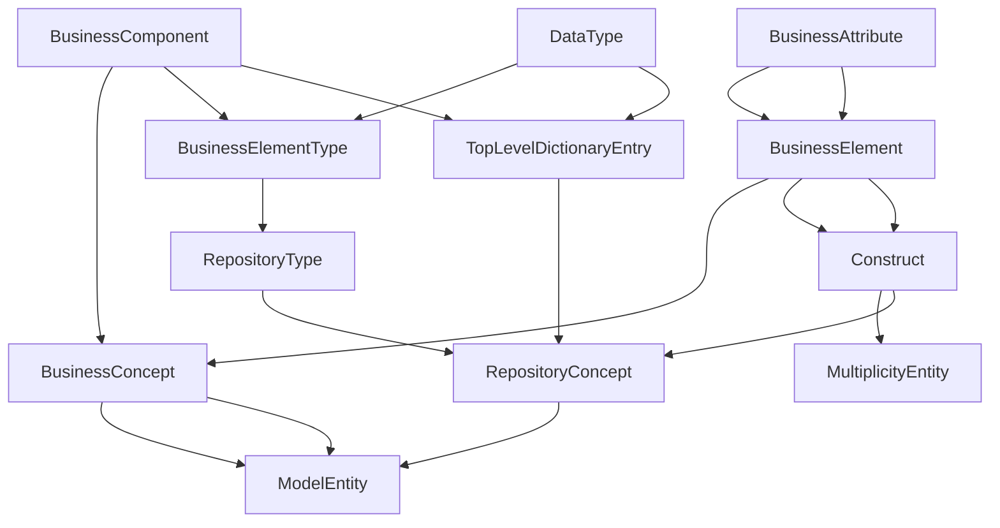

# Pruning & Dry-Run

Pruning lets you keep or remove classes before exporting a new instance file.

## Example: Conceptual pruning

This example keeps only conceptual Business* classes and DataType, includes supertypes
so inherited attributes are retained, and serializes default values (e.g.,
`registrationStatus="Provisionally Registered"`). It also strips references to
pruned classes and logs attribute defaults.

```bash
emf-read \
  --ecore /var/software/input/ISO20022.ecore \
  --instance /var/software/input/20250424_ISO20022_2013_eRepository.iso20022 \
  --export-instance /tmp/iso20022_conceptual_pruned.iso20022.xml \
  --include-classes BusinessComponent,BusinessElement,BusinessAssociationEnd,BusinessAssociation,BusinessAttribute,DataType \
  --prune-include-supertypes \
  --prune-serialize-defaults \
  --prune-strip-refs \
  --prune-debug-attrs
```

### What you specify vs what gets included

The include list (what you specify):


With `--prune-include-supertypes`, these supertypes are also included to preserve inherited
attributes (e.g., `registrationStatus` from `RepositoryConcept`):



Notes:

- `--prune-serialize-defaults` forces default values (including enum defaults) to appear in the output.
- `--prune-strip-refs` removes references to pruned objects to keep the result consistent.
- The output keeps the containment chain (Repository → DataDictionary → TopLevelDictionaryEntry) by default.

## Dry-run (metamodel only)

```bash
emf-read \
  --ecore /var/software/input/ISO20022.ecore \
  --include-classes BusinessComponent,BusinessAssociationEnd \
  --exclude-classes BusinessProcess \
  --prune-dry-run \
  --prune-dry-run-json /tmp/prune_preview.json
```

Dry-run reports:

- selected/pruned classes
- pruned containment features
- pruned reference features

Use `--prune-include-supertypes` to keep the supertypes of included classes
so inherited attributes remain visible in the pruned model view.
Use `--prune-no-containers` to disable including containment ancestors (by default,
the export keeps the containment chain to ensure a valid root structure).

## Export filtered instance

```bash
emf-read \
  --ecore /var/software/input/ISO20022.ecore \
  --instance /var/software/input/20250424_ISO20022_2013_eRepository.iso20022 \
  --export-instance /tmp/filtered.iso20022 \
  --include-classes BusinessComponent,BusinessAssociationEnd \
  --exclude-classes BusinessProcess \
  --prune-include-supertypes \
  --prune-strip-refs \
  --prune-serialize-defaults
```
